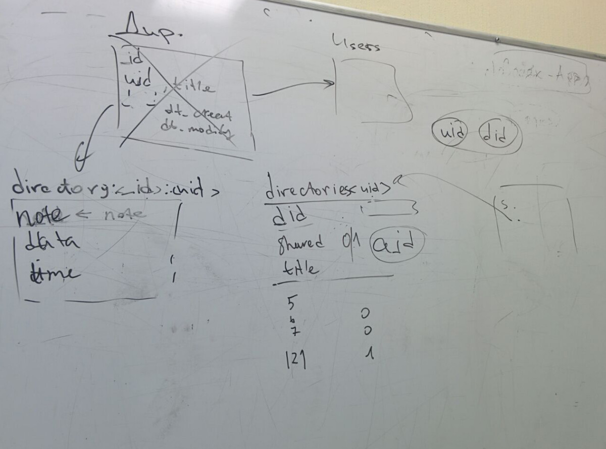
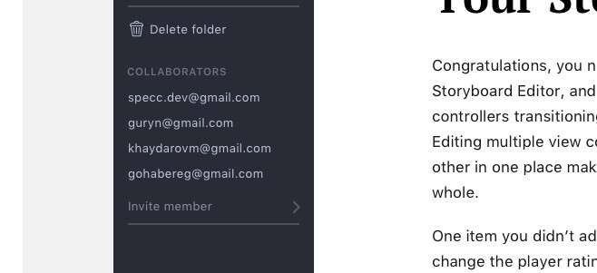

# Database

## Collections

| Name | Description |
| -- | -- |
| `users` | All users  |
| `folders:<owner_id>`  |  List of user's folders |
| `collaborators:<owner_id>:<folder_id>` | Collaborators list for the specified folder |
| `notes:<owner_id>:<folder_id>` | List of notes in a directory |

All `ids` is an [ObjectId](http://php.net/manual/en/class.mongodb-bson-objectid.php) from specified collection:

- `<owner_id>` — `_id` from `users`
- `<folder_id>` — `_id` from `folders:<owner_id>`
- `<note_id>` — `_id` from `notes:<owner_id>:<folder_id>`

## Folder creation

### 1. Add a document in the `folders:<owner_id>`

#### Fields

| Param | Type | Description |
|--|--|--|
| `_id` | mongoId | unique mongo id |
| `is_shared` | boolean | `false` on creation, `true` on sharing |
| `owner_id` | mongoId | Person who created a directory |
| `title` | string | Folder title |
| ... | ... | other directory data |

where `is_shared` — 0
where `sharer_id` — current user

### 2. Create `notes:<owner_id>:<folder_id>` for the current user with created `folder_id`

## Invite a collaborator

### 1. Add an email to the `collaborators:<owner_id>:<folder_id>`

`owner_id` — folder owner, who send an invitation
`folder_id` — shared folder id

#### Fields

| Param | Type | Description |
|--|--|--|
| `_id` | mongoId | unique mongo id |
| `email` | string | Invitation acceptor's email |
| `user_id` | mongoId \| null (default) | Invitation acceptor's `_id` from `users`. |
| `invitation_token` | string | Token with `<owner_id>:<folder_id>:<hash>`  |
| `dt_add` | mongoId | Date of an invitation |

### 2. Send an email with `invitation token`

Invitation token contains:

**`<owner_id>:<folder_id>:<hash>`**

- `owner_id` — Who sent an invitation
- `folder_id` — On which folder
- `hash` — Security hash with (`owner_id`+`folder_id`+`salt`)

### 3. User came from email with the `invitation token`. On the API public page with button `Download an app`

### 4. User downloads an app and start it.

### 5. User clicks on `Accept an invitation` button with custom `codex://` protocol, that can be handled by CodeX Notes.

### 6. An app sends request `/verifyCollaborator` to the API with the user's `invitation token` and new user's `_id`

### 7. API `/verifyCollaborator`:

- Get `owner_id` and `folder_id` from the token, validate with `hash`.
- Select collection `collaborators:<owner_id>:<folder_id>`
- Update an email status to `accepted`, and save a new user's `_id`;
- Add a new folder to the `folders:<acceptor_id>` (invited user) with `owner_id` (current user) and `is_shared` = 1
- Update an item in the `folders:<owner_id>` (current user) with `is_shared` = 1
- send a response with the shared folder data and notes list

## Adding a new note in a shared folder

1. Send `/sync` event with new item: it will be newer that `dt_sync`, where stored date of last synchronisation
2. API: in the `/sync` event we've got a new Note with `folder_id` and other note's data
4. Get all collaborators from `collaborators:<owner_id>:<folder_id>`
5. Add (or update) a document in the `notes:<owner_id>:<folder_id>`

#### Fields

| Param | Type | Description |
|--|--|--|
| `_id` | mongoId | `Note` unique mongo id |
| `note` | json | `Note` data |
| `dt_add` | timestamp | `Note` creation date |
| `dt_modify` | timestamp | `Note` last updating date |

